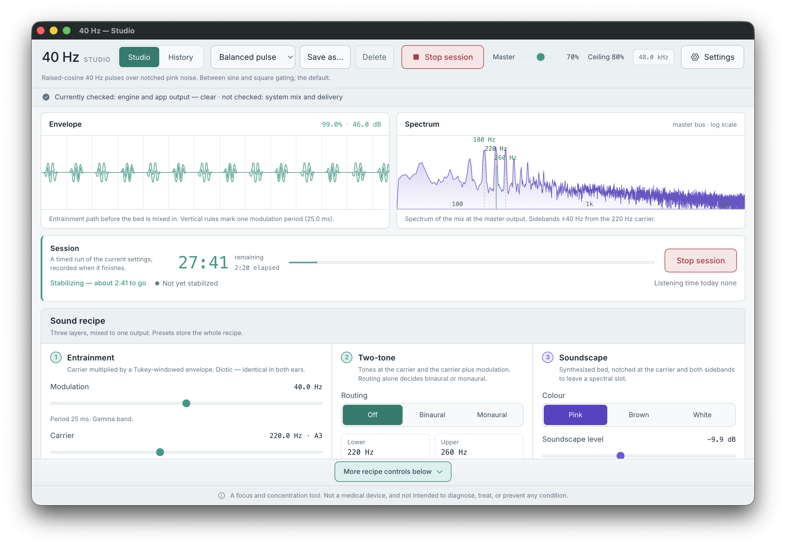
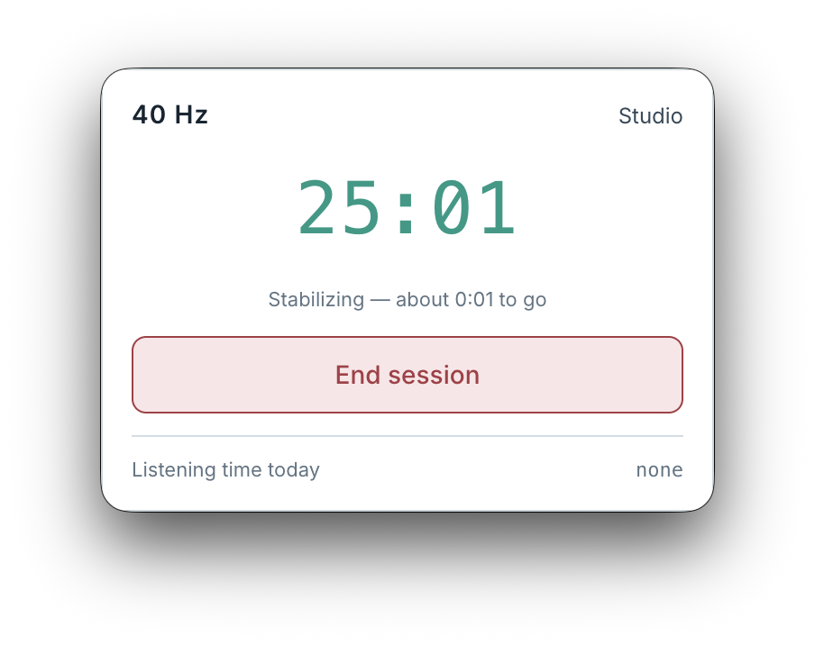

# 40 Hz Studio

**A desktop app that generates sound pulsing 40 times a second — live, not from a recording.**

A 40 Hz track is fixed when it is made. Here the pitch, pulse shape, modulation depth and noise
underneath are controls you move while you listen, and the envelope and spectrum redraw as you do.

Why 40 Hz? It is a rate that has drawn research attention. Whether listening to it does anything
for you has not been established, and this app makes no claim that it does. It exists so you can
generate a clean signal, see what is in it, and experiment on your own terms.

**[Download for macOS, Windows or Linux](https://github.com/fstolze/40Hz/releases)** — or
[build it from source](docs/building.md).

<picture>
  <source media="(prefers-color-scheme: dark)" srcset="docs/images/home-dark.png">
  
</picture>

## Your first session

1. Install the app. The first launch needs [one extra step](#install).
2. Turn your system volume low and press **Preview** on the default preset, **Balanced pulse**.
3. Move **Modulation**, **Carrier** or **Depth**. Nothing restarts.
4. When you like what you hear, pick a duration and press **Start session**. Unlike Preview, a
   session is recorded in History.

## Shape the sound

A **sound recipe** layers three sources:

- **Entrainment** — the pulsed tone. Set its rate, its pitch, and how soft or sharp each pulse is.
- **Two-tone** — two tones beating at the pulse rate: **Binaural** for headphones, or **Monaural**
  for speakers.
- **Soundscape** — pink, brown or white noise, notched so the tone keeps its own space.

Six built-in presets give you starting points, each described by its signal rather than a promised
effect. [Every control, in detail](docs/usage.md#the-sound-recipe).

## What it checks, and what it cannot

The app checks its own work. At launch the engine tests its arithmetic; during playback it compares
the tones it is playing against a reference render of the same settings. A status line under the
header shows the result.

Nothing checks the operating system's mixer, Bluetooth, your headphones or the air. A clear result
describes the audio the app produced, not what reached your ears.
[What each check covers](docs/usage.md#signal-integrity).

## Sessions, the tray and history

A session is a timed listen of 10 to 60 minutes. Started from Studio, it plays whatever Studio
holds, unsaved edits included. Started from the tray, it plays a saved preset, and Studio never has
to open.

Sound ramps in and fades out to finish on time. There is no pause. A global shortcut stops playback
from anywhere, and nothing ever plays unless you start it, including when the app launches at login.

**History** records what each session played, for how long and how it ended, and can load a past
recipe back into Studio. [Sessions and history in detail](docs/usage.md#sessions).

## Private and local

Audio is synthesized on your machine. Presets, history and settings are files on your computer, and
you can delete them whenever you like. There is no account, no telemetry, and nothing is sent
anywhere.

## Install

Supported systems are macOS 26, Windows 11 and Ubuntu 24.04 or later. Download the file for yours
from [Releases](https://github.com/fstolze/40Hz/releases); the app installs as **40 Hz**.

Builds are not signed by a trusted publisher, so the first launch needs one extra step:

<b>macOS</b>

Open the `.dmg` (`arm64` for Apple silicon, `x64` for Intel) and drag 40 Hz to Applications. When
the first launch is blocked, go to **System Settings → Privacy & Security** and choose **Open
Anyway**. Alternatively, run `xattr -dr com.apple.quarantine "/Applications/40 Hz.app"` in
Terminal.

<b>Windows</b>

Run the `.exe` installer (x64). It installs for your user, with no administrator prompt. When
SmartScreen shows "Windows protected your PC", choose **More info**, then **Run anyway**. The tray
icon starts hidden behind the **^** arrow in the taskbar.

<b>Linux</b>

On Debian or Ubuntu, install the `.deb` with `sudo apt install ./<file>.deb`. The `.AppImage` runs
without installing once you make it executable (`chmod +x`), though it may need FUSE 2 on the
newest distributions. Both are x64. Whether a tray icon appears depends on your desktop; GNOME
needs a StatusNotifierItem (AppIndicator) extension.

## Intended use

40 Hz Studio is for listening during focused work, and for people who want to experiment with
auditory entrainment. It is not a medical device, and it is not intended to diagnose, treat, cure
or prevent any condition. Whether any of these signals helps concentration has not been
established.

Output peaks are capped at 80% of full scale. That is a limit on the digital signal, not on loudness
at your ears, so start with your system volume low.

## Documentation

- [Using 40 Hz Studio](docs/usage.md) — every control, sessions and history, settings, keyboard
  shortcuts and troubleshooting
- [Building from source](docs/building.md)

## License

[PolyForm Noncommercial 1.0.0](LICENSE). You may use, modify and share 40 Hz Studio for
noncommercial purposes.
